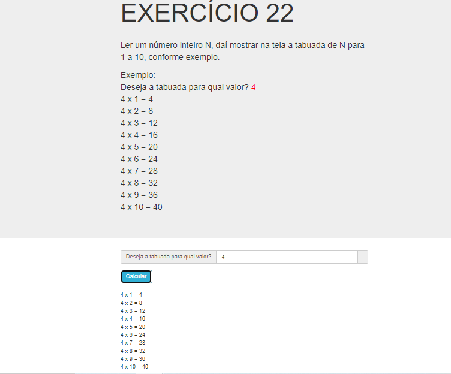

# Jovens Tegranos Exercicio 22

# 🏁 **Tópicos**

 * 👉 Banner
 * 👉 Título e Descrição
 * 👉 Status do Projeto
 * 👉 Funcionalidades
 * 👉 Demonstração da aplicação
 * 👉 Pré-requisitos
 * 👉 Tecnologias utilizadas
 * 👉 Autor
 * 👉 Licença
 
 ____________________________________________________________
# ✅ Banner 👌

<h1 align="center">
  
</h1>

# ✅ Título e Descrição 👌

### Exercicio 22

#### Ler um número inteiro N, daí mostrar na tela a tabuada de N para 1 a 10, conforme exemplo.

            Exemplo:
            Deseja a tabuada para qual valor? 4
            4 x 1 = 4
            4 x 2 = 8
            4 x 3 = 12
            4 x 4 = 16
            4 x 5 = 20
            4 x 6 = 24
            4 x 7 = 28
            4 x 8 = 32
            4 x 9 = 36
            4 x 10 = 40
       

# ✅ Status do Projeto 👌

### 🚧 Projeto 🚀 **Concluído com Sucesso!!!** 👌 🚧

# ✅ Funcionalidades 👌

### - [x] Ler um número inteiro N.
### - [x] Mostrar na tela a tabuada de N para 1 a 10.

# ✅ Demonstração da aplicação 👌

<h1 align="center">
  
</h1>

### GitHub AlineAlmeida85

### Link: [Projeto](https://alinealmeida85.github.io/Jovens-Tegranos-Exercicio22/)

# ✅ Pré-requisitos 👌

### Nenhum, basta clicar no link acima

# ✅ Tecnologias utilizadas ⚒️ 👌

### As seguintes tecnologias foram usadas na construção do projeto:

- [HTML](https://pt.wikipedia.org/wiki/HTML)
- [CSS](https://pt.wikipedia.org/wiki/Cascading_Style_Sheets)
- [JavaScript](https://www.javascript.com/)
- [Lógica de Programação]()

# ✅ Autor 👌

### Aline Almeida 💝

# ✅ Licença

### Não Possui

#### Espero que te agrade! ❤️

